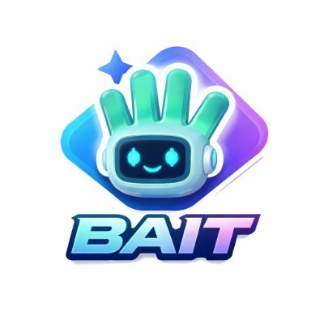

<p align="center">
  
</p>

# BAIT — 基于 BNB Chain 的 AI 推文引擎

<p align="center">
  <strong>秒级生成病毒式加密内容。构建于 BNB Chain。</strong>
</p>

<p align="center">
  <a href="https://baitvibe.lovable.app">在线体验</a> •
  <a href="#功能特性">功能特性</a> •
  <a href="#应用场景">应用场景</a> •
  <a href="#技术架构">技术架构</a> •
  <a href="#快速开始">快速开始</a> •
  <a href="../README.md">English</a>
</p>

---

## BAIT 是什么？

**BAIT** 是一款专为 **BNB Chain** 生态系统打造的 Web3 原生 AI 内容引擎。它彻底改变了加密项目方、DAO 和 DeFi 协议创建高互动 Twitter/X 内容的方式 — 用 AI 驱动的病毒式评分、智能改写和线程生成取代低效的手动创作。

BAIT 诞生于 Binance AI Pro 内部的一次实验，从一个测试信号进化为服务 BNB 生态系统数千名建设者的全栈内容 dApp。

---

## 功能特性

| 功能 | 描述 |
|------|------|
| 🤖 **AI 推文撰写** | 描述你的想法 → 一键生成刷屏推文 |
| 🔄 **智能改写** | 粘贴任意推文 → 获得带有钩子、结构和行动号召的优化版本 |
| 🧵 **线程构建器** | 将一个主题变成 5-10 条结构化推文线程，自动排版 |
| 📊 **病毒式评分** | 每条输出在发布前都会获得 AI 驱动的互动评分 |
| 🌐 **Web3 原生** | 基于顶级加密推文训练 — 精通 DeFi、NFT 和建设者文化 |
| 🔗 **BNB 钱包连接** | 通过 WalletConnect 和 MetaMask 原生集成 BSC 钱包 |

---

## 应用场景

### 🏦 BNB Chain 上的 DeFi 协议
项目发布公告、代币经济学解析、流动性挖矿活动 — BAIT 生成将关注者转化为用户的内容。

### 🎨 NFT 项目与 DAO
铸造公告、治理提案、社区更新 — 结构化线程驱动互动和参与。

### 📢 加密 KOL 与建设者
每日 Alpha 线程、项目评测、市场评论 — 持续高质量输出，告别创作倦怠。

### 🌐 BNB Chain 生态营销
生态更新、合作伙伴公告、开发者引导内容 — 规模化的专业级传播。

---

## 技术架构

### 深度技术栈

```
┌─────────────────────────────────────┐
│          前端 (React)               │
│  Vite • TypeScript • Tailwind CSS  │
│  shadcn/ui • Framer Motion         │
├─────────────────────────────────────┤
│        Web3 层 (BSC)                │
│  wagmi • viem • WalletConnect      │
│  BNB Chain (ChainID: 56)           │
├─────────────────────────────────────┤
│        AI 内容引擎                   │
│  LLM 驱动的推文生成                  │
│  病毒式评分算法                      │
│  风格迁移与改写管道                   │
├─────────────────────────────────────┤
│      后端 (Lovable Cloud)           │
│  PostgreSQL • Edge Functions        │
│  Auth • Realtime • Storage          │
└─────────────────────────────────────┘
```

### 核心技术决策

- **BNB Chain 优先**：原生 BSC 钱包连接 — MetaMask 注入 + WalletConnect v2 协议，实现无缝接入。
- **AI 管道**：多阶段内容管道 — 意图提取 → 风格匹配 → 病毒式优化 → 互动评分。
- **实时评分**：每条生成的推文都基于 10 万+ 高表现加密推文训练的模型进行评估。
- **边缘优先架构**：无服务器边缘函数实现低延迟 AI 推理，全球部署。

---

## 快速开始

### 环境要求

- Node.js 18+
- npm 或 bun

### 安装

```bash
# 克隆仓库
git clone <YOUR_GIT_URL>

# 进入项目目录
cd bait

# 安装依赖
npm install

# 启动开发服务器
npm run dev
```

### 环境变量

| 变量 | 描述 |
|------|------|
| `VITE_SUPABASE_URL` | 后端 API 端点（自动配置） |
| `VITE_SUPABASE_PUBLISHABLE_KEY` | 公共 API 密钥（自动配置） |

---

## BNB Chain 集成

BAIT 专为 **BNB Chain** 生态系统构建：

- **网络**：BNB Smart Chain (BSC) 主网 — Chain ID `56`
- **RPC**：`https://bsc-dataseed.binance.org`
- **浏览器**：[BscScan](https://bscscan.com)
- **钱包支持**：MetaMask、WalletConnect、Trust Wallet 及所有 BSC 兼容钱包

平台利用 BNB Chain 的低交易费用和高吞吐量，非常适合链上内容验证和未来的推文 NFT 铸造功能。

---

## 路线图

- [x] 带病毒式评分的 AI 推文撰写器
- [x] 带前后对比的智能改写器
- [x] 带自动结构的线程构建器
- [x] BSC 钱包集成（WalletConnect + MetaMask）
- [ ] 链上推文铸造（BNB Chain 上的 BEP-721）
- [ ] 代币门控高级功能（BSC 上的 $BAIT）
- [ ] 内容策展的 DAO 治理
- [ ] 多链扩展（opBNB、Greenfield）

---

## 技术栈

| 层级 | 技术 |
|------|------|
| 前端 | React 18, TypeScript, Vite, Tailwind CSS |
| UI | shadcn/ui, Lucide Icons, 自定义设计系统 |
| Web3 | wagmi, viem, WalletConnect, BNB Chain (BSC) |
| 后端 | Lovable Cloud (PostgreSQL, Edge Functions, Auth) |
| AI | LLM 驱动的内容引擎 + 病毒式评分 |

---

## 贡献

BAIT 使用 [Lovable](https://lovable.dev) 构建。欢迎贡献 — 提交 Issue 或 PR。

---

## 许可证

MIT

---

<p align="center">
  <strong>为建设者而生。由 BNB Chain 驱动。🔶</strong>
</p>
